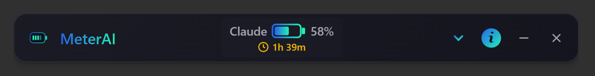
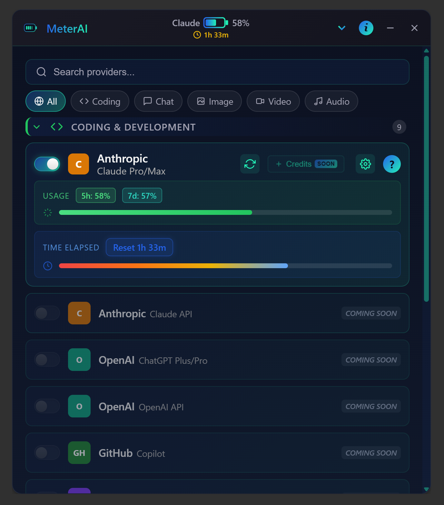
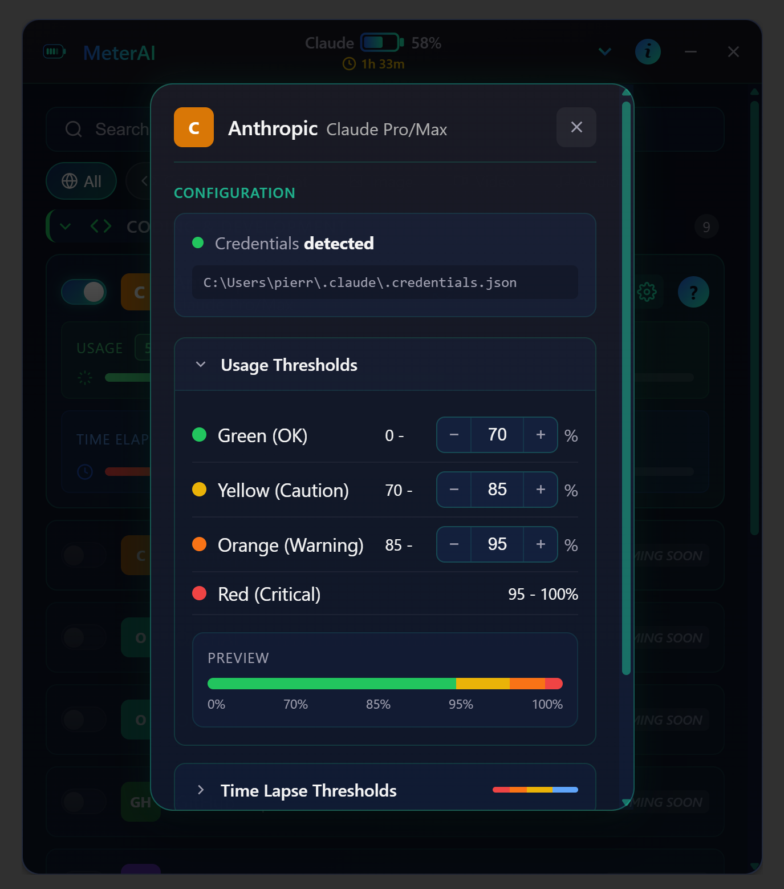

<p align="center">
  
</p>

<h1 align="center">MeterAI</h1>

<p align="center">
  <strong>Track your AI usage in real-time</strong><br>
  A lightweight, privacy-first desktop widget for monitoring Claude, OpenAI, and other AI services.
</p>

<p align="center">
  <a href="https://github.com/PopeYeahWine/MeterAI/releases"></a>
  <a href="https://github.com/PopeYeahWine/MeterAI/blob/main/LICENSE"></a>
  
</p>

---

## Screenshots

<p align="center">
  <br>
  <em>Compact always-on-top widget showing usage at a glance</em>
</p>

<p align="center">
  <br>
  <em>Expanded view with provider list, categories, and detailed usage</em>
</p>

<p align="center">
  <br>
  <em>Configuration panel with customizable thresholds</em>
</p>

---

## Key Features

- **Always-on-Top Widget** — Floating, draggable bar that stays visible while you work
- **Claude Code Integration** — Automatic OAuth-based tracking for Claude Pro/Max (no API key needed)
- **Rolling Window Timer** — Real-time countdown to your next usage reset (5-hour window)
- **Color Thresholds** — Visual indicators: green (OK), yellow (caution), orange (warning), red (critical)
- **Desktop Notifications** — Configurable alerts when you approach usage limits
- **System Tray Mode** — Minimize to tray, quick access from notification area
- **Multi-Provider Support** — Track 30+ AI services from a single dashboard
- **Privacy-First** — All data stored locally, no telemetry, no cloud sync
- **Cross-Platform** — Windows, macOS, and Linux support

---

## How It Works

1. **For Claude Pro/Max users**: MeterAI automatically detects your Claude Code credentials and fetches your real usage data via Anthropic's OAuth API
2. **For other providers**: Configure your API keys in the settings panel to enable tracking
3. **The widget displays**:
   - Current usage percentage with color-coded status
   - Time remaining until reset (rolling 5-hour window for Claude)
   - Quick access to expand/collapse and configure

### Usage Flow

```
┌─────────────────────────────────────────────────────────┐
│  MeterAI         Claude ████░░ 58%    ▼  ⓘ  —  ✕      │
│                        ⏱ 1h 39m                        │
└─────────────────────────────────────────────────────────┘
        ↓ Click chevron to expand
┌─────────────────────────────────────────────────────────┐
│  Provider List                                          │
│  ├── Coding & Development                               │
│  │   ├── Claude Pro/Max ████████░░ 58%                 │
│  │   ├── Claude API (coming soon)                       │
│  │   ├── OpenAI ChatGPT Plus/Pro                       │
│  │   └── GitHub Copilot                                │
│  ├── Chat                                               │
│  ├── Image                                              │
│  └── ...                                                │
└─────────────────────────────────────────────────────────┘
```

---

## Supported Providers

| Provider | Status | Auth Method |
|----------|--------|-------------|
| **Claude Pro/Max** | ✅ Available | Auto-detect (Claude Code OAuth) |
| Claude API | 🔜 Coming Soon | API Key |
| OpenAI ChatGPT Plus/Pro | 🔜 Coming Soon | OAuth |
| OpenAI API | 🔜 Coming Soon | API Key |
| GitHub Copilot | 🔜 Coming Soon | OAuth |
| Google Gemini | 🔜 Coming Soon | OAuth |
| Midjourney | 🔜 Coming Soon | — |
| And 25+ more... | 🔜 Planned | — |

---

## Installation

### Download

Go to [**Releases**](https://github.com/PopeYeahWine/MeterAI/releases) and download the installer for your platform:

| Platform | File |
|----------|------|
| Windows | `MeterAI_x.x.x_x64-setup.exe` or `.msi` |
| macOS | `MeterAI_x.x.x_x64.dmg` |
| Linux | `MeterAI_x.x.x_amd64.AppImage` or `.deb` |

### Requirements

- **Windows**: Windows 10/11 (x64). WebView2 Runtime (usually pre-installed)
- **macOS**: macOS 10.15+ (Intel & Apple Silicon via Rosetta)
- **Linux**: Most distributions with GTK3 and WebKit2GTK

---

## Usage

### Quick Start

1. **Install and launch** MeterAI
2. **Claude Code users**: Your credentials are auto-detected — just enable tracking when prompted
3. **Other providers**: Click the chevron → select a provider → configure in settings
4. **Monitor** your usage in real-time from the floating widget

### System Tray

Right-click the tray icon for quick actions:
- **Show** — Bring widget to front
- **Quit** — Exit application

### Keyboard Shortcuts

- Click and drag the widget to reposition
- Click chevron (▼) to expand/collapse
- Click (ⓘ) for about and settings

---

## Privacy & Security

MeterAI is designed with privacy as a core principle:

- **Local-only storage** — All data stays on your machine
- **No telemetry** — We don't collect any usage data or analytics
- **No cloud sync** — Your configuration never leaves your device
- **Secure credential storage** — API keys stored in OS credential manager:
  - Windows: Credential Manager
  - macOS: Keychain
  - Linux: Secret Service API (GNOME Keyring / KWallet)
- **Open source audit** — Source code available for security review

### Data Location

| Platform | Path |
|----------|------|
| Windows | `%LOCALAPPDATA%\meter-ai\data.json` |
| macOS | `~/Library/Application Support/meter-ai/data.json` |
| Linux | `~/.local/share/meter-ai/data.json` |

---

## Roadmap

We're actively developing MeterAI. Here's what's coming:

### In Progress
- [ ] OpenAI ChatGPT Plus/Pro tracking
- [ ] Claude API usage tracking
- [ ] GitHub Copilot integration

### Planned
- [ ] Google Gemini support
- [ ] VS Code extension
- [ ] Import/export configuration
- [ ] Notification customization (sounds, schedules)
- [ ] Usage history and statistics
- [ ] Multiple account support

### Future Ideas
- [ ] Team usage tracking
- [ ] OAuth login for OpenAI / Google
- [ ] Buy credits directly from the app
- [ ] Mobile companion app (iOS/Android)
- [ ] Webhook integrations

Have a feature request? [Open an issue](https://github.com/PopeYeahWine/MeterAI/issues)!

---

## Troubleshooting

### Widget doesn't start
- **Windows**: Install [WebView2 Runtime](https://developer.microsoft.com/en-us/microsoft-edge/webview2/) if not present
- **Linux**: Ensure `libwebkit2gtk-4.0` is installed

### Claude Code not detected
- Make sure you're logged into Claude Code CLI or VS Code extension
- Check that `~/.claude/.credentials.json` exists
- Try the manual file picker in settings

### No notifications
- Check your OS notification settings
- Allow MeterAI in privacy/notification settings

---

## Contributing

While MeterAI is source-available, we welcome:
- Bug reports via [GitHub Issues](https://github.com/PopeYeahWine/MeterAI/issues)
- Feature suggestions and feedback
- Security vulnerability reports (see [SECURITY.md](SECURITY.md))

---

## Support the Project

If MeterAI helps you stay productive, consider supporting development:

**BTC**: `bc1qnav0zef8edpgtr0t7vkylyt0xly4vxzgwaerrt`

**USDC (ETH)**: `0xaE42e321F2672A072b2e7421FF0E6Aa117cCd667`

---

## License

This software is **proprietary and source-available** (not open source).

The source code is provided for transparency and security auditing purposes only. See [LICENSE](LICENSE) for full terms.

**Copyright (c) 2026 HPSC — All Rights Reserved**

For licensing inquiries: [@PopeYeahWine](https://github.com/PopeYeahWine)
