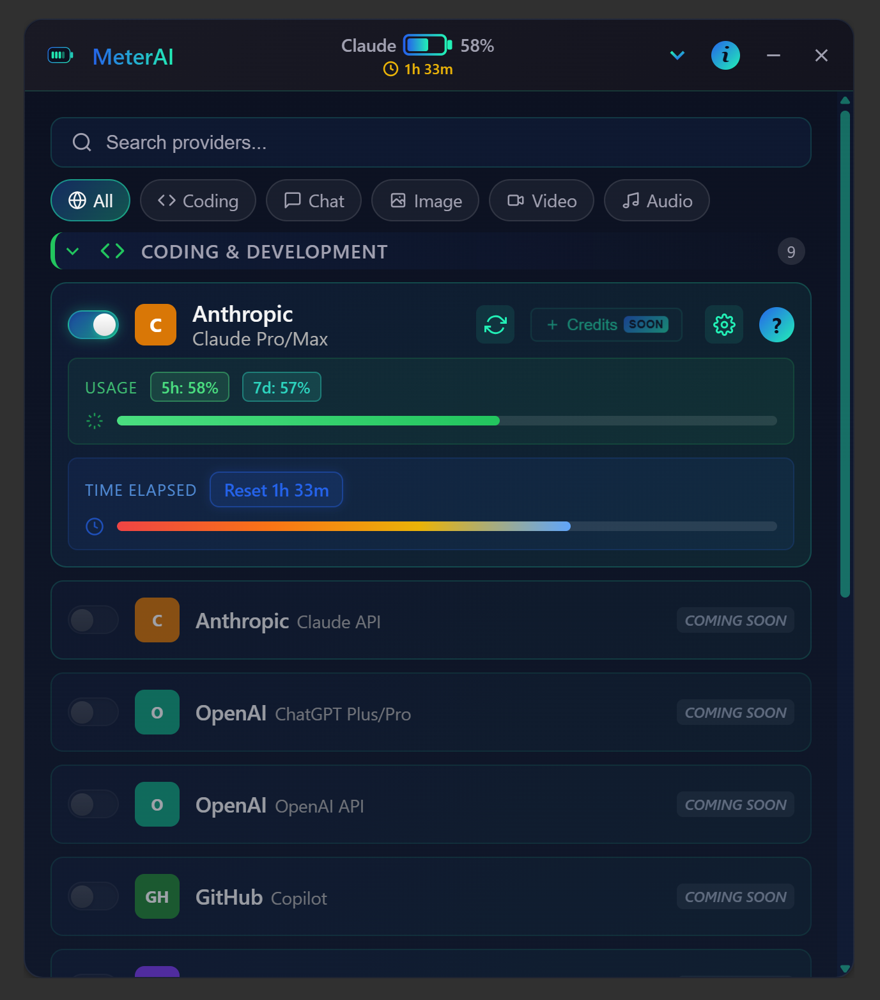
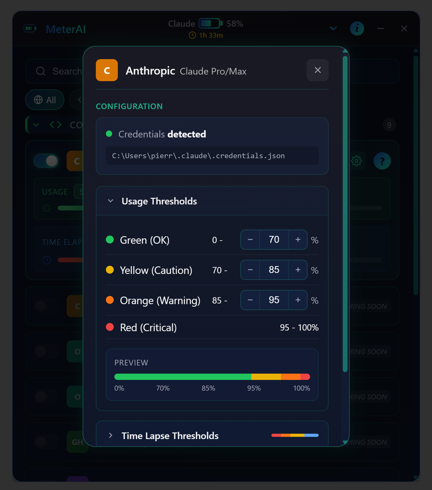

<p align="center">
  
</p>

<h1 align="center">MeterAI</h1>

<p align="center">
  <strong>Track your AI usage in real-time</strong><br>
  A lightweight, privacy-first desktop widget for monitoring Claude, OpenAI, and other AI services.
</p>

<p align="center">
  <a href="https://github.com/PopeYeahWine/MeterAI/releases"></a>
  <a href="https://marketplace.visualstudio.com/items?itemName=hpsc-sas.meterai-vscode"></a>
  <a href="https://github.com/PopeYeahWine/MeterAI/blob/main/LICENSE"></a>
  
</p>

---

## Screenshots

<p align="center">
  <br>
  <em>Compact always-on-top widget showing usage at a glance</em>
</p>

<p align="center">
  <br>
  <em>Expanded view with provider list, categories, and detailed usage</em>
</p>

<p align="center">
  <br>
  <em>Configuration panel with customizable thresholds</em>
</p>

---

## Key Features

- **Always-on-Top Widget** — Floating, draggable bar that stays visible while you work
- **Claude Code Integration** — Automatic OAuth-based tracking for Claude Pro/Max (no API key needed)
- **Claude API Integration** — Anthropic usage/cost tracking with Admin API key (`sk-ant-admin-...`)
- **OpenAI Codex Integration** — Automatic local token-based tracking for ChatGPT Free/Go/Pro and compatible Codex plans
- **Rolling Window Timer** — Real-time countdown to your next usage reset (5-hour window)
- **Color Thresholds** — Visual indicators: green (OK), yellow (caution), orange (warning), red (critical)
- **Desktop Notifications** — Configurable alerts when you approach usage limits
- **System Tray Mode** — Minimize to tray, quick access from notification area
- **Multi-Provider Support** — Track 30+ AI services from a single dashboard
- **Privacy-First** — All data stored locally, no telemetry, no cloud sync
- **Cross-Platform** — Windows, macOS, and Linux support

---

## How It Works

1. **For Claude Pro/Max users**: MeterAI automatically detects your Claude Code credentials and fetches your real usage data via Anthropic's OAuth API
2. **For OpenAI Codex users**: MeterAI reads your local Codex session/token data and displays real usage windows without requiring an API key
3. **For Claude API users**: Add an Anthropic Admin API key to fetch monthly usage/cost data
4. **For other providers**: Configure your API keys in the settings panel to enable tracking
5. **The widget displays**:
   - Current usage percentage with color-coded status
   - Time remaining until reset (rolling 5-hour window for Claude)
   - Quick access to expand/collapse and configure

### Usage Flow

```
┌─────────────────────────────────────────────────────────┐
│  MeterAI         Claude ████░░ 58%    ▼  ⓘ  —  ✕      │
│                        ⏱ 1h 39m                        │
└─────────────────────────────────────────────────────────┘
        ↓ Click chevron to expand
┌─────────────────────────────────────────────────────────┐
│  Provider List                                          │
│  ├── Coding & Development                               │
│  │   ├── Claude Pro/Max ████████░░ 58%                 │
│  │   ├── Claude API $12.34 / $0.00                      │
│  │   ├── OpenAI ChatGPT Plus/Pro                       │
│  │   └── GitHub Copilot                                │
│  ├── Chat                                               │
│  ├── Image                                              │
│  └── ...                                                │
└─────────────────────────────────────────────────────────┘
```

---

## Supported Providers

| Provider | Auth Method |
|----------|-------------|
|  **Claude Pro/Max** | Auto-detect (Claude Code OAuth) |
|  **Claude API** | API Key (Anthropic Admin key) |
|  **OpenAI Codex** | Auto-detect (local Codex token/session) |
|  **OpenAI API** | API Key |

---

## Installation

### VS Code Extension

- Marketplace: https://marketplace.visualstudio.com/items?itemName=hpsc-sas.meterai-vscode
- Install command:

```bash
code --install-extension hpsc-sas.meterai-vscode
```

> The VS Code extension is intentionally minimal (status bar view). For a richer visual interface, use the desktop app below.

### Download

| Platform | File | Download |
|----------|------|----------|
| Windows | `MeterAI_1.3.1_x64-setup.exe` | [Download](https://github.com/PopeYeahWine/MeterAI/releases/download/v1.3.0/MeterAI_1.3.1_x64-setup.exe) |
| Windows | `MeterAI_1.3.0_x64_en-US.msi` | [Download](https://github.com/PopeYeahWine/MeterAI/releases/download/v1.3.0/MeterAI_1.3.0_x64_en-US.msi) |
| macOS (Intel) | `MeterAI_1.3.1_x64.dmg` | [Download](https://github.com/PopeYeahWine/MeterAI/releases/download/v1.3.0/MeterAI_1.3.1_x64.dmg) |
| macOS (Apple Silicon) | `MeterAI_1.3.0_aarch64.dmg` | [Download](https://github.com/PopeYeahWine/MeterAI/releases/download/v1.3.0/MeterAI_1.3.0_aarch64.dmg) |
| Linux | `MeterAI_1.3.1_amd64.AppImage` | [Download](https://github.com/PopeYeahWine/MeterAI/releases/download/v1.3.0/MeterAI_1.3.1_amd64.AppImage) |
| Linux | `MeterAI_1.3.1_amd64.deb` | [Download](https://github.com/PopeYeahWine/MeterAI/releases/download/v1.3.0/MeterAI_1.3.1_amd64.deb) |

> You may see a Windows SmartScreen warning when running the installer. This is normal for applications pending code signing approval. See [Code Signing Policy](#code-signing-policy) below.

### Requirements

- **Windows**: Windows 10/11 (x64). WebView2 Runtime (usually pre-installed)
- **macOS**: macOS 10.15+ (Intel & Apple Silicon)
- **Linux**: Most distributions with GTK3 and WebKit2GTK

---

## Usage

### Quick Start

1. **Install and launch** MeterAI
2. **Claude Code users**: Your credentials are auto-detected — just enable tracking when prompted
3. **Other providers**: Click the chevron → select a provider → configure in settings
4. **Monitor** your usage in real-time from the floating widget

### System Tray

Right-click the tray icon for quick actions:
- **Show** — Bring widget to front
- **Quit** — Exit application

### Keyboard Shortcuts

- Click and drag the widget to reposition
- Click chevron (▼) to expand/collapse
- Click (ⓘ) for about and settings

---

## Privacy & Security

MeterAI is designed with privacy as a core principle:

- **Local-only storage** — All data stays on your machine
- **No telemetry** — We don't collect any usage data or analytics
- **No cloud sync** — Your configuration never leaves your device
- **Secure credential storage** — API keys stored in OS credential manager:
  - Windows: Credential Manager
  - macOS: Keychain
  - Linux: Secret Service API (GNOME Keyring / KWallet)
- **Open source audit** — Source code available for security review

### Data Location

| Platform | Path |
|----------|------|
| Windows | `%LOCALAPPDATA%\meter-ai\data.json` |
| macOS | `~/Library/Application Support/meter-ai/data.json` |
| Linux | `~/.local/share/meter-ai/data.json` |

---

## Product Roadmap

Last updated: **2026-02-21**

---

### Roadmap Done

| Area | Delivered |
|------|-----------|
| Core app | Always-on-top widget, compact/expanded/settings views, drag-to-move, tray integration |
| Provider tracking | Claude Pro/Max OAuth usage tracking (5h and 7d windows) |
| Provider tracking | Claude API billing tracking via Anthropic Admin Usage & Cost API (`claude-api`) |
| Provider tracking | OpenAI Codex local tracking from Codex token/session logs (5h and 7d windows) |
| Provider tracking | OpenAI API billing tracking (pay-as-you-go and hard-limit handling) |
| UX & alerts | Threshold-based visual states and desktop notifications |
| Reliability | Auto-refresh polling, stale-cache fallback, and Codex expired-window reset fix |
| Ecosystem | VS Code extension MVP (status bar usage for Claude/Codex from local data) |
| Provider catalog | 30+ providers with status badges (`Available`, `Coming soon`, `Planned`, `Awaiting partnership`) |
| Security & privacy | Local-only storage, secure credential storage via OS keychain/credential store, no telemetry |
| Distribution | Cross-platform packaging (Windows/macOS/Linux), update checks, release artifacts |

---

### Roadmap To Do

| Priority | Item | Scope |
|----------|------|-------|
| P1 | Coming-soon API providers (wave 1) | Implement `mistral`, `elevenlabs`, `stability`, `runway` |
| P1 | Usage analytics | Add history graph + depletion prediction in widget/expanded view |
| P1 | Code signing completion | Finalize SignPath approval and ship signed Windows builds |
| P2 | Data portability | Export/import config and usage history (`CSV`/`JSON`) |
| P2 | Power-user UX | Mini mode, global hotkeys, multi-widget support |
| P2 | Alerting integrations | Webhooks (Discord/Slack/Teams) and scheduled summaries |
| P3 | Ecosystem extensions | Publish VS Code extension, then local REST API and Stream Deck plugin |

---

### Feature Requests

Have an idea? [Open an issue](https://github.com/PopeYeahWine/MeterAI/issues) with the `enhancement` label.

---

## Troubleshooting

### Widget doesn't start
- **Windows**: Install [WebView2 Runtime](https://developer.microsoft.com/en-us/microsoft-edge/webview2/) if not present
- **Linux**: Ensure `libwebkit2gtk-4.0` is installed

### Claude Code not detected
- Make sure you're logged into Claude Code CLI or VS Code extension
- Check that `~/.claude/.credentials.json` exists
- Try the manual file picker in settings

### No notifications
- Check your OS notification settings
- Allow MeterAI in privacy/notification settings

---

## Contributing

MeterAI is open source under GPL-3.0-or-later. We welcome:
- Bug reports via [GitHub Issues](https://github.com/PopeYeahWine/MeterAI/issues)
- Feature suggestions and feedback
- Pull requests (see [CONTRIBUTING.md](CONTRIBUTING.md))
- Security vulnerability reports (see [SECURITY.md](SECURITY.md))

---

## Support the Project

If MeterAI helps you stay productive, consider supporting development:

**BTC**: `bc1qnav0zef8edpgtr0t7vkylyt0xly4vxzgwaerrt`

**USDC (ETH)**: `0xaE42e321F2672A072b2e7421FF0E6Aa117cCd667`

---

## Code Signing Policy

MeterAI has applied for free open-source code signing through [SignPath Foundation](https://signpath.org).

**Current status:** Pending approval

Once approved, Windows releases will be signed with a certificate provided by SignPath Foundation. Until then, you may see SmartScreen warnings when installing — this is expected for unsigned applications.

### Verification (after approval)

To verify a signed release:
1. Right-click the `.exe` or `.msi` file
2. Select **Properties** → **Digital Signatures** tab
3. Confirm the signature shows "SignPath Foundation"

### Team roles

- **Committers and reviewers:** [@PopeYeahWine](https://github.com/PopeYeahWine)
- **Approvers:** [@PopeYeahWine](https://github.com/PopeYeahWine)

### Privacy policy

This program will not transfer any information to other networked systems unless specifically requested by the user or the person installing or operating it.

For detailed privacy information, see [PRIVACY.md](PRIVACY.md).

---

## License

This software is licensed under the **GNU General Public License v3.0 or later** (GPL-3.0-or-later).

You are free to use, modify, and distribute this software under the terms of the GPL. See [LICENSE](LICENSE) for full terms.

**Copyright (c) 2026 HPSC**

For inquiries: [@PopeYeahWine](https://github.com/PopeYeahWine)
