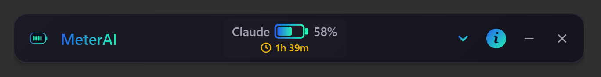

# MeterAI for VS Code

MeterAI adds live usage meters for Claude Code and OpenAI Codex directly in the VS Code status bar.

## Features

- Automatic provider detection (Claude Code and/or Codex)
- Battery-style usage meter (`║████║`) with remaining percentage
- Reset countdown visible inline in the status bar
- Manual refresh command and configurable auto-refresh interval
- Local-first parsing of Claude/Codex session data (no API key required)
- No local file paths or project paths shown in status bar or tooltip

## Screenshots

The VS Code extension UI lives in the status bar.

If you want a full dashboard UI, MeterAI Desktop is available:




## Want a richer visual app?

- Repository: https://github.com/PopeYeahWine/MeterAI
- Desktop releases: https://github.com/PopeYeahWine/MeterAI/releases

## Install

After publication, install from the Visual Studio Code Marketplace:

```bash
code --install-extension popeyeahwine.meterai-vscode
```

## Package and Publish

```bash
cd vscode-extension
npm install
npm run package
```

Then publish (requires Azure DevOps PAT configured for `vsce`):

```bash
npm run publish:vsce
```

## Development

```bash
cd vscode-extension
npm install
npm run compile
```

In VS Code:

1. Open the `vscode-extension` folder.
2. Press `F5` to launch the Extension Development Host.
3. Run `MeterAI: Refresh Usage` from the Command Palette.

## Settings

- `meterai.statusBar.refreshIntervalSeconds`: auto-refresh interval (seconds)
- `meterai.statusBar.showClaude`: show Claude usage
- `meterai.statusBar.showCodex`: show Codex usage
- `meterai.statusBar.showResetCountdown`: show reset countdown

## Privacy

MeterAI reads local Claude/Codex data required to compute usage. It does not display local file paths in the UI.
